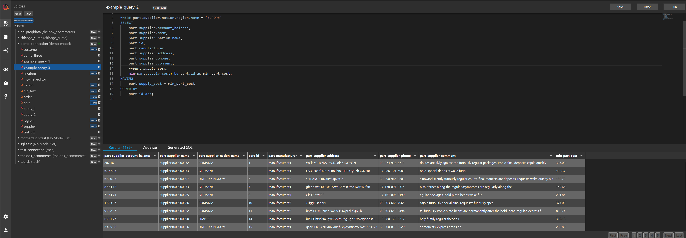

# Trilogy Studio Core

A publically available, minimal IDE for exploring Trilogy, an experiment in streamlined analytic SQL. 

Makes experimenting with Trilogy simple.
- rich semantic layer
- streamlined reuse, sharing, and composition
- visualization 
- llm integration [alpha]
- scheduling [WIP]

Open source, MIT licensed.

## This Repo

This repo contains a component library for the studio frontend and a minimal FastAPI backend service to support it.

Try a hosted version [here](https://trilogydata.dev/trilogy-studio-core/).

Read more about Trilogy [here](https://trilogydata.dev/).

