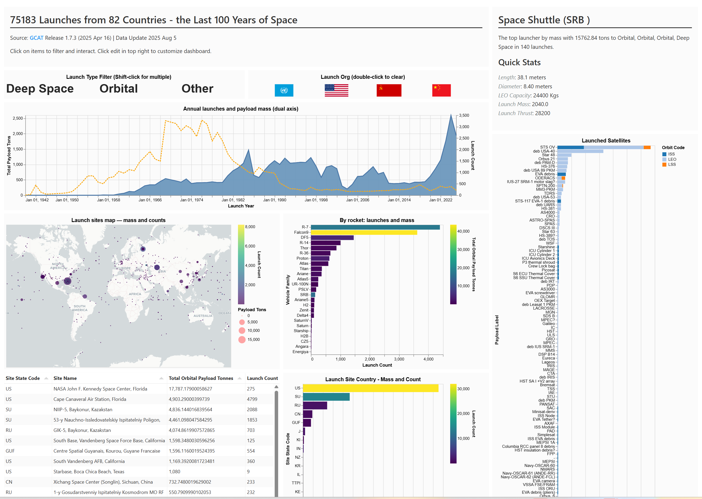

# Trilogy Studio Core

A open-source IDE for exploring [Trilogy](https://github.com/trilogy-data/pytrilogy), an experiment in streamlined analytic SQL. 

Try a hosted studio instance here [here](https://trilogydata.dev/trilogy-studio-core/).

Supports
- DuckDB
- BigQuery
- Snowflake

Read more about Trilogy, the language [here](https://trilogydata.dev/).

## This Repo

This repo contains the studio frontend, a minimal FastAPI language server that powers language features, and an MCP server example that can run queries.

## Docker

The suggested local execution option for now. (An app will come at some point!)

A docker container is available in the base repo. Image runs resolution service [FastAPI] + statically serves frontend. 

No telemetry enabled by default.

From repo root:

### Bash
```bash
docker build -t trilogy-studio:latest && docker run -p 8080:80 trilogy-studio:latest   
```

### Powershell
```powershell
docker build -t trilogy-studio:latest . ; docker run  -p 8080:80 trilogy-studio:latest   
```

Access on http://localhost:8080 (or alternative port used).

### Flexible Visualization

Explore data with easy, interactive visuals. Connect them in rich, interactive dashboards that can be shared.

Native cross filtering, drilldown, and LLM-enhanced filtering. 

<p align="center">

</p>

### Rich Query Editing

All the modern IDE features you expect, built-in autocomplete, type checking.

<p align="center">

</p>


### MCP Server

Provides a basic integration to be used with assistants like Claude desktop. Supports executing queries as well as parsing.

## Run MCP Locally

### Claude Desktop

Trilogy Studio can be run as a local MCP server for Claude. It'll by default only have access to the default public models.
Support for custom models coming soon!

Checkout repo, and from root run below:

```bash
uv run mcp install pyserver/mcp_server.py
```

Or directly edit:

On MacOS: `~/Library/Application\Support/Claude/claude_desktop_config.json`
On Windows: `%APPDATA%/Claude/claude_desktop_config.json`

```json
"mcpServers": {
    "Trilogy Language Tools": {
      "command": "C:\\Users\\ethan\\.local\\bin\\uv.EXE",
      "args": [
        "run",
        "--with",
        "mcp[cli]",
        "--with",
        "pytrilogy",
        "--with",
        "trilogy-public-models",
        "mcp",
        "run",
        "<repo_root>\\pyserver\\mcp_server.py"
      ]
    }
}
```

## Run Language Server

> [!TIP]
> Quick Setup: Run `npm install` in the root, followed by `pip install -r requirements.txt` in the pyserver subfolder. You can then use `npm run local` to start a local instance.

This will run the frontend with Vite as well as the backend language server.

You can confirm in settings that your local UI is resolving to localhost.

There will be a more polished local option in the future.

## Deploying As Service

You can build a production copy and serve as a static website. Github Pages is an easy hosting option for frontend and there is an existing actions pipeline to use as a model.

## Developing

Contributions loved! See contributing guide for details.

### Inspiration
There are lots of good IDEs out here. Trilogy Studio is probably only best if you want to use Trilogy. Some sources of inspiration:

- Dbeaver
- SQL Server Management Studio
- BQ Cloud Console
- [Beekeeper Studio](https://www.beekeeperstudio.io/)
- [QuackDB](https://github.com/mattf96s/QuackDB)
- [SQL Workbench](https://sql-workbench.com/)

### Tech Stack

Exists thanks to the following:

Frontend
- Vue
- Vega/Altair
- Tabulator

Backend
- Lark (python)

